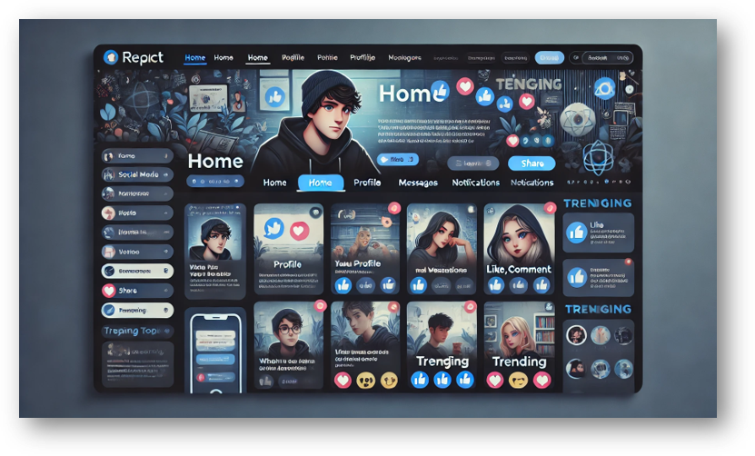
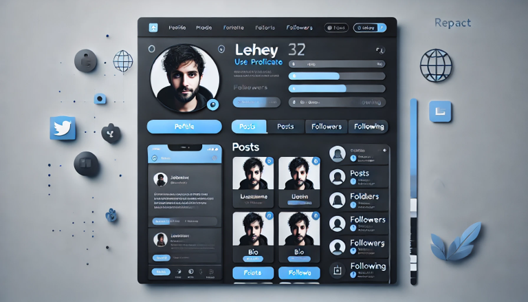
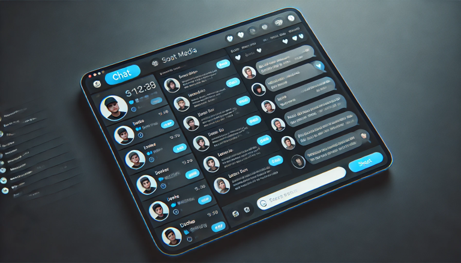
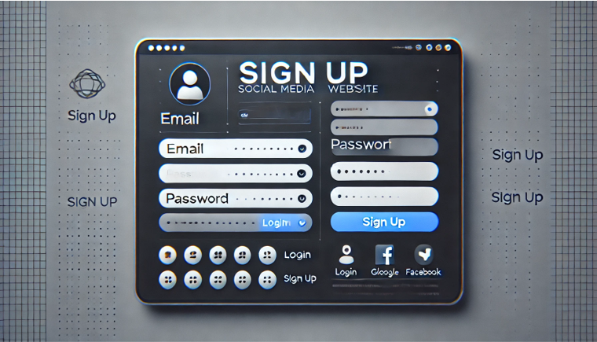

# Connectify - Frontend-Only Social Media Website

## 📌 Project Overview  
Connectify is a frontend-only social media platform built with React.js that allows users to view and interact with posts, update their profiles, and chat using dummy data.

## 🔹 Tech Stack  
- **Frontend:** React.js, React Router, Tailwind CSS  
- **State Management:** React Context API / useState  
- **Data Handling:** Local Storage / JSON Placeholder (Dummy Data)  
- **UI Components:** Material UI / Shadcn / Custom Components  

## 🔹 Key Features & Milestones  

### 🟢 Phase 1: Project Setup & UI Design  
✅ Initialize React.js project  
✅ Set up routing with React Router  
✅ Implement UI components (Navbar, Sidebar, Buttons)  

### 🟢 Phase 2: User Feed & Profile  
✅ Create a dummy user feed (JSON data for posts)  
✅ Implement profile page with editable details (local storage)  

### 🟢 Phase 3: Social Interactions  
✅ Like and comment functionality (stored in local state)  
✅ Follow/unfollow system (local storage simulation)  

### 🟢 Phase 4: Chat System (Mockup)  
✅ Basic chat UI with dummy messages  
✅ Allow sending messages (but not saved after refresh)  

### 🟢 Phase 5: UI Enhancements & Deployment  
✅ Dark mode toggle  
✅ Improve UI/UX with animations  
✅ Deploy on Vercel or Netlify  

## 🔹 Project Timeline  

| Phase               | Tasks                                  | Timeline |
|---------------------|--------------------------------------|----------|
| Setup & UI Design  | React setup, Routing, UI Setup       | 1 week   |
| User Feed & Profile | Display posts, Profile Page         | 2 weeks  |
| Social Features    | Likes, Comments, Follow system       | 1 week   |
| Chat System (Mock) | Basic messaging UI (No backend)      | 1 week   |
| Enhancements       | Dark mode, UI fixes, Deployment      | 1 week   |

## 📸 Project Images  

### 1️⃣ Home Feed (Posts & Interactions)  
A sleek interface with user posts, images, text, and interaction buttons.  

### 2️⃣ User Profile Page  
Profile picture, cover photo, bio, and user posts.  

### 3️⃣ Chat System (Coming Soon!)  
A clean chat interface with conversations and real-time messages.  

### 4️⃣ Login & Signup Page (Coming Soon!)  

